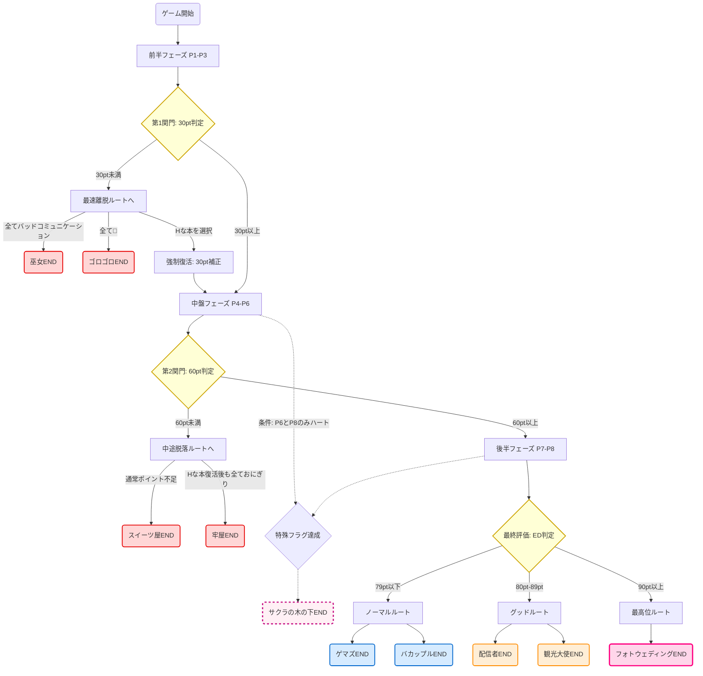

# おかゆにゅ～～む！ エンディング分岐＆完全攻略ルート表

本シートは、内部のポイント（pt）計算と足切りシステムを解明し、すべてのエンディングへの分岐条件をまとめた完全攻略ガイドです。

---

## 🎯 エンディング分岐の全体図（全10種フローチャート）

ゲームの進行（フェーズ）に応じた「3つの足切り・判定の壁」によって、エンディングは以下のように分岐します。このチャートを追うことで、自分がいまどの足切りラインにいるのかが一目で分かります！

### 🚨 中途脱落（バッドエンド系）
* **【フェーズ4：30ptの壁】**（大晦日到達時）
  * 📉 **巫女END** （ポイント不足 ＋ おかにゃん選択）
  * 📉 **おかゆんとゴロゴロEND** （すべて🍙の最低スコア ＋ おかにゃん選択）
* **【フェーズ7：60ptの壁】**（おかゆ誕生日到達時）
  * 📉 **スイーツ屋END** （30ptの壁は越えたが、60ptに届かず途中終了）
  * 📉 **牢屋END** （Hな本で復活後もすべて🍙を選び続け、60ptに届かず終了）

### 🏁 最終到達（ノーマル～グッド系）
フェーズ8まで完走したのち、最終的な累計ポイントで以下にランク分けされます。
* **【79pt以下】（ノーマル層）**
  * 🥉 **ゲマズEND** （ルートA系列）
  * 🥉 **バカップルEND** （ルートB系列）
* **【80pt〜89pt】（グッド層）**
  * 🥈 **配信者END** （ルートA系列）
  * 🥈 **観光大使END** （ルートB系列）

### 👑 特殊・最高位到達（真エンド系）
* 🥇 **フォトウェディングEND** （すべての選択肢で❤️を選び、全ミニゲームを成功させた100点満点のパーフェクトルート）
* 🌸 **サクラの木の下END** （バレンタインとホワイトデーのみ❤️を選び、他はすべて🍙を選ぶ特殊フラグ回収ルート）

---

## 🛣️ エンディング別・到達ルート一覧

（各フェーズの選択肢で、高ポイント＝❤️、低ポイント＝🍙として表記しています）

### 👑 100点満点・パーフェクト到達層
| ルート | フェーズ1 | フェーズ2 | フェーズ3(中盤) | フェーズ4 | フェーズ5(後半) | フェーズ6(撮影等) | フェーズ7 | フェーズ8 | 最終到達エンド |
| :---: | :--- | :--- | :--- | :--- | :--- | :--- | :--- | :--- | :--- |
| **8** | 布団❤️ おでこ❤️ | ぬいぐるみ❤️ 耳❤️ | 抱き寄せる❤️ あご❤️ | 大吉❤️ はな❤️ | 手握り鉦❤️ 頭❤️ | バレンタイン❤️ おなか❤️ | お布団❤️ ふともも❤️ | 製菓キット❤️ あご❤️ | **フォトウェディングEND** |

### 🌸 特殊フラグ達成
| ルート | フェーズ1 | フェーズ2 | フェーズ3(中盤) | フェーズ4 | フェーズ5(後半) | フェーズ6(撮影等) | フェーズ7 | フェーズ8 | 最終到達エンド |
| :---: | :--- | :--- | :--- | :--- | :--- | :--- | :--- | :--- | :--- |
| **10** | 全て🍙 | 全て🍙 | 全て🍙 | 全て🍙 | 全て🍙 | バレンタイン❤️ おなか❤️ | 全て🍙 | 製菓キット❤️ あご❤️ | **サクラの木の下END** |

### 🥈 配信者 / 観光大使 / ゲマズ / バカップル（最終到達・ルート分岐）
| ルート系 | フェーズ1 | フェーズ2 | フェーズ3(中盤) | フェーズ4 | フェーズ5(後半) | フェーズ6(撮影等) | フェーズ7 | フェーズ8 | 最終到達エンド |
| :---: | :--- | :--- | :--- | :--- | :--- | :--- | :--- | :--- | :--- |
| **A系 (1,2)** | シャツ❤️ おでこ❤️ | 卵味噌🍙 ふともも🍙 | 抱き寄せる❤️ あご❤️ | 大凶🍙 おなか🍙 | ねぶた絵🍙 尻尾🍙 | バレンタイン❤️ おなか❤️ | 本🍙 鎖骨🍙 | 製菓キット❤️ あご❤️ | **80↑: 配信者END** *79↓: ゲマズEND* |
| **B系 (3,4)** | シャツ❤️ おでこ❤️ | 卵味噌🍙 ふともも🍙 | 抱き寄せる❤️ あご❤️ | 大凶🍙 おなか🍙 | ねぶた絵🍙 尻尾🍙 | バレンタイン❤️ おなか❤️ | 本🍙 鎖骨🍙 | チョコの箱🍙 肩🍙 | **80↑: 観光大使END** *79↓: バカップルEND* |

### 📉 第2足切り（60pt未満でフェーズ7脱落）
| ルート | フェーズ1 | フェーズ2 | フェーズ3(中盤) | フェーズ4 | フェーズ5(後半) | フェーズ6(撮影等) | 第2関門 | 最終到達エンド |
| :---: | :--- | :--- | :--- | :--- | :--- | :--- | :--- | :--- |
| **5** | 布団🍙 おでこ❤️ | ぬいぐるみ❤️ 耳❤️ | 飲み物🍙 手🍙 | 大吉❤️ はな❤️ | 手握り鉦❤️ 頭❤️ | おにぎり🍙 頬🍙 | 60pt足切り | **スイーツ屋END** |
| **9** | すべて🍙 | ミニゲーム 成功 | *(Hな本で復帰)* 大凶🍙 おなか🍙 | ねぶた絵🍙 尻尾🍙 | おにぎり🍙 頬🍙 | 60pt足切り | **牢屋END** |

### 📉 第1足切り（30pt未満でフェーズ4脱落）
| ルート | フェーズ1 | フェーズ2 | フェーズ3(中盤) | フェーズ4合間 | 第1関門 | 最終到達エンド |
| :---: | :--- | :--- | :--- | :--- | :--- | :--- |
| **6** | シャツ❤️ おでこ❤️ | Q1(0pt) / 卵味噌🍙 耳❤️ | 飲み物🍙 あご❤️ | なでなで 失敗(2pt) | (30ptで足切り) おかにゃん | **巫女END** |
| **7** | 布団🍙 二の腕🍙 | Q1(1pt) / 卵味噌🍙 ふともも🍙 | 飲み物🍙 手🍙 | なでなで 失敗(2pt) | (30ptで足切り) おかにゃん | **おかゆんとゴロゴロEND** |

---

## 📊 基礎攻略データ（ポイントの稼ぎ方）

### 💡 2×2 スキンシップ表（高点数＝❤️ / 低点数＝🍙）
| フェーズ | ❤️（高ポイント） | 🍙（低ポイント） | 
| :--- | :--- | :--- | 
| **1: にゃふにゃふT** | 【2pt】布団❤️ / おでこ❤️ | 【1pt】シャツ🍙 / にのうで(二の腕)🍙 | 
| **2: にゃふにゃふ** | 【4pt】ぬいぐるみ❤️ / みみ(耳)❤️ | 【2pt】たまご味噌(卵味噌)🍙 / ふともも🍙 | 
| **3: にゃふ(中盤)** | 【5pt】抱き寄せる❤️ / あご❤️ | 【3pt】飲み物差し入れ🍙 / 手🍙 | 
| **4: おかゆなでなで** | 【2pt】左のおみくじ(大吉)❤️ / はな❤️ | 【1pt】右のおみくじ(大凶)🍙 / おなか🍙 | 
| **5: にゃふ(後半)** | 【2pt】手振り鉦❤️ / 頭❤️ | 【1pt】ねぶた絵🍙 / 尻尾🍙 | 
| **6: 撮影タイム** | 【4pt】バレンタイン❤️ / おなか❤️ | 【0pt】おにぎり🍙 / 頬🍙 | 
| **7: 泡取り除き(前半)** | 【3pt】お布団❤️ / ふともも❤️ | 【2pt】妹モノの本(店売り)🍙 / 鎖骨🍙 | 
| **8: 泡取り除き(後半)** | 【6pt】製菓キット❤️ / あご❤️ | 【3pt】チョコの箱🍙 / 肩🍙 | 

### 🎁 合間のミニゲーム＆プラン加算（最大44pt）
| 発生タイミング | イベント名 | 最大ポイント | 備考 |
| :--- | :--- | :--- | :--- |
| **フェーズ1と2の間** | プラン（紅葉狩り / リンゴ狩り） | **3pt** | 例：きのこ(3pt) |
| **フェーズ1と2の間** | Q1（行き先択） | **2pt** | 酸ヶ湯(2pt) / 青森・八戸(1pt) |
| **フェーズ2と3の間** | プラン（津軽鉄道 / 市場） | **3pt** | 例：車内に留まる(3pt) 等 |
| **フェーズ3と4の間** | ミニゲーム（おかゆをなでなでしよう） | **6pt** | 成功で6pt、失敗でも2pt |
| **フェーズ4と5の間** | プラン（氷爆ツアー / 水族館） | **3pt** | 例：五目並べ(3pt)等 |
| **フェーズ4と5の間** | ミニゲーム（野球拳） | **5pt** | 勝ったら5pt、負けたら2pt |
| **フェーズ5と6の間** | プラン（八甲田山の樹氷 / ウィンタースポーツ） | **3pt** | 例：樹氷を見に行く(3pt)等 |
| **フェーズ6と7の間** | 写真撮影① | **5pt** | バレンタインポーズ＆胸(5pt) / 顔(4pt) / はずれ(0pt) |
| **フェーズ7と8の間** | ミニゲーム（泡取り除きゲーム） | **4pt** | 成功で4pt、失敗で3pt |
| **フェーズ8とENDの間** | Q2（お風呂の味） | **4pt** | 抹茶(4pt) / チョコ(0pt) / バニラ(0pt) |
| **フェーズ8とENDの間** | 写真撮影② | **6pt** | ぺろ＆ヘソ(6pt) / チラ＆へそ(2pt) / はずれ(0pt) |

---
* スキンシップ最大56pt ＋ ミニゲーム最大44pt ＝ **完全パーフェクトで「100点満点」システム！**
* 途中の「Hな本」は、失敗による低ポイント状態から強制的に【30pt】までスコアを巻き戻して（下駄をはかせて）くれる救済（または牢屋行きの罠）アイテムです。
